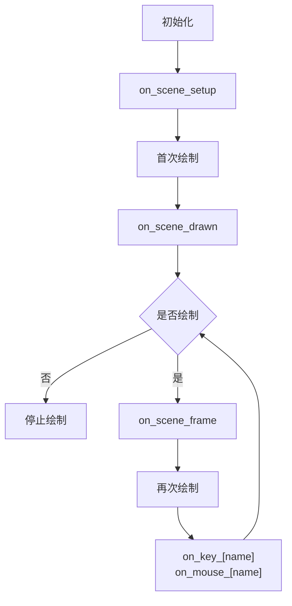

# PsychoPy-Scene


[English](README.md) | 简体中文

本项目是基于 [PsychoPy](https://github.com/psychopy/psychopy) 的轻量级实验框架，源码仅 **200 行**。

> [!NOTE]
> 本项目旨于提供构建 PsychoPy 实验的新方式，仅提供基础 API，并鼓励开发者对本项目进行二次开发。

## 特性

- 轻量级：只有 1 个文件，无额外依赖项
- 类型安全：所有参数均使用类型注解
- 新人友好：仅需掌握 `Context` 和 `Scene` 的概念即可上手

## 安装

```bash
pip install psychopy-scene
```

或直接复制 `psychopy_scene` 文件夹到项目根目录。

## 快速上手

### 实验上下文

实验上下文 `Context` 表示实验的全局参数，包括环境参数和任务参数。
编写实验的第一步，就是创建实验上下文。

```python
from psychopy_scene import Context
from psychopy.visual import Window
from psychopy.monitors import Monitor
from psychopy.data import ExperimentHandler

# create monitor
monitor = Monitor(
    name="testMonitor",
    width=52.65,
    distance=57,
)
monitor.setSizePix((1920, 1080))

# create window
win = Window(
    monitor=monitor,
    units="deg",
    fullscr=False,
    size=(800, 600),
)

# create experiment context
ctx = Context(
    win,
    exp=ExperimentHandler(extraInfo={"subject": "test"}),
)
```

### 画面

实验可以被当作一系列画面 `scene` 的组合，编写实验程序只需要 2 步：

1. 创建画面
2. 编写画面呈现逻辑

画面提供了一些配置参数：

- `duration`：持续时间，单位为秒
- `close_on`：关闭画面的[事件](#事件)名称，比如`key_f`表示按下键盘`F`键关闭画面
- `on_key_[name]`：当按下键盘上某个键时执行的函数
- `on_mouse_[name]`：当按下鼠标某个键时执行的函数
- `on_scene_[name]`：在画面的特定阶段发生时执行的函数

创建画面仅需 1 个接受刺激参数并返回刺激的函数即可：

```python
from psychopy.visual import TextStim

# create stimulus
stim_1 = TextStim(ctx.win, text="Hello")
stim_2 = TextStim(ctx.win, text="World")

# create scene
@ctx.scene(
    duration=1,
    close_on=["key_f", "mouse_right"],
    on_key_escape=lambda: print("escape key was pressed"),
    on_mouse_left=lambda: print("left mouse button was pressed"),
    on_scene_drawn=lambda: print("it will be called after first drawing"),
    on_scene_frame=lambda: print("it will be called each frame"),
)
def demo(color: str, ori: float): # it will be used as on_scene_setup
    print('it will be called before first drawing')
    stim_1.color = color
    stim_2.ori = ori
    return stim_1, stim_2

# show scene
demo.show(color="red", ori=45)
```

画面还可以动态配置，这在一些场景中很有用，比如呈现时间不固定的画面：

```python
@ctx.scene()
def demo():
    return stim
demo.config(duration=0.5).show()
```

这里的`demo.config`和`ctx.scene`的作用是完全等效的，他们的输入参数也完全一致。

### 事件

事件表示程序运行时的某个特定时机，比如按下某个键、鼠标点击等。
要想在事件发生时执行一些操作，我们需要为事件添加回调函数：

```python
demo = ctx.scene(close_on="key_f") # or
demo = ctx.scene(on_key_f=lambda: demo.close()) # or
demo = ctx.scene().on("key_f", lambda: demo.close())
```

> [!NOTE]
> 每种事件只能有一个回调函数，重复添加将报错。

用于设置回调函数的参数名都遵循`on_[type]_[name]`的格式。
目前画面支持的事件有：

| 类型  | 名称                                    |
| ----- | --------------------------------------- |
| scene | setup、drawn、frame                     |
| key   | any、其余和`Keyboard.getKeys`返回值一样 |
| mouse | left、right、middle                     |

这些事件将在`show`方法执行后按顺序触发：



### 数据

画面呈现过程中会自动收集数据：
| 名称 | 描述 |
| --------- | ---------------------------- |
| show_time | 首次绘制的时间戳 |
| events | 交互事件列表：键盘事件和鼠标事件 |

我们可以通过 `scene.get` 访问这些数据：

```python
@ctx.scene(close_on=["key_f", "key_j"])
def demo():
    return stim
demo.show()
close_event = demo.get("events")[-1]
close_key = close_event.key.value
close_time = close_event.rt
```

我们还可以手动收集数据：

```python
@ctx.scene(
    on_key_f=lambda: demo.set('rt', core.getTime() - demo.get('show_time')),
)
def demo():
    return stim
demo.show()
rt = demo.get('rt')
```

## 快捷方法

`Context` 还提供了一些快捷方法，可以简化实验编写：

```python
ctx.text('Welcome to the experiment!', pos=(0, 0)).show() # show static text
ctx.fixation(1).show()
ctx.blank(1).show()
ctx.addRow(a='', b=1, c=True) # collect data to ExperimentHandler
```

## 最佳实践

### 上下文和任务分离

推荐以函数形式编写任务，将实验上下文作为第一参数传入，其余参数作为任务的特有参数。

```python
from psychopy_scene import Context

def task(ctx: Context, duration: float):
    from psychopy.visual import TextStim

    stim = TextStim(ctx.win, text="")
    scene = ctx.scene(duration, on_scene_setup=lambda: stim)
    scene.show()
    ctx.addRow(time=scene.get('show_time'))
```

### 只关注任务相关的逻辑

任务函数不应包含任何与任务本身无关的逻辑，例如：

- 指导语和结束语
- block 数量
- 数据处理、分析、结果展示

如果 block 间不存在数据依赖的话，建议一个任务函数只呈现一个 block。
对于需要呈现多个 block 的实验，考虑以下示例：

```python
from psychopy_scene import Context
from psychopy.visual import Window

def task(ctx: Context):
    from psychopy.visual import TextStim

    stim = TextStim(ctx.win, text="")
    scene = ctx.scene(1, on_scene_setup=lambda: stim)
    scene.show()
    ctx.addRow(time=scene.get('show_time'))

win = Window()
data = []
for block_index in range(10):
    ctx = Context(win)
    ctx.exp.extraInfo['block_index'] = block_index
    task(ctx)
    block_data = ctx.exp.getAllEntries()
    data.extends(block_data)
```
