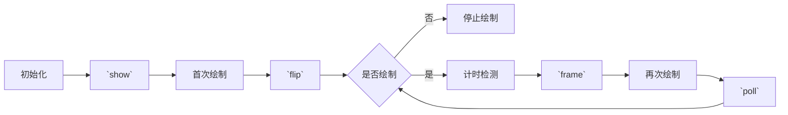

# PsychoPy-Scene


[English](README.md) | 简体中文

基于 [PsychoPy](https://github.com/psychopy/psychopy) 的轻量级实验框架，核心源码 **<150 行**。

> [!NOTE]
> 本项目处于早期开发阶段，使用时请固定版本号。

## 特性

- 轻量级：只有 2 个文件，无额外依赖项
- 类型安全：使用泛型进行类型推导
- 新人友好：仅需掌握 `Context` 和 `Scene` 的概念即可上手

## 安装

```bash
pip install psychopy-scene
```

## 快速上手

### 实验上下文

实验上下文 `Context` 表示实验的全局参数，包括环境参数和任务参数。
编写实验的第一步，就是创建实验上下文。

```python
from psychopy import visual, data
from psychopy_scene import Context

ctx = Context(win=visual.Window(), exp=data.ExperimentHandler())
```

### 画面

实验可以被当作一系列画面 `scene` 的组合，编写实验程序只需要 2 步：

1. 创建画面
2. 编写画面呈现逻辑

通过装饰器创建画面：

```python
from psychopy import visual
from psychopy.hardware import keyboard
from psychopy_scene.decorator import duration, hardware_keyboard

# create stimulus
stim_1 = visual.TextStim(ctx.win, text="Hello")
stim_2 = visual.TextStim(ctx.win, text="World")

# create scene
@duration(1)
@ctx.scene
def demo_1(color: str, ori: float):
    print('it will be called before first flip')
    stim_1.color = color
    stim_2.ori = ori
    return stim_1, stim_2

@close_on('key_space')
@hardware_keyboard()
@ctx.scene
class demo_2:
    scene: Scene
    def __call__(self, text: str):
        stim_1.text = text
        return stim_1
    def on_key_space(self, evt: keyboard.KeyPress):
        self.scene.data['rt'] = evt.tDown - self.scene.data['frame_times'][0]

# show scene
data_1 = demo_1.show(color="red", ori=45)
data_2 = demo_2.show(text="test")
```

部分装饰器允许被覆盖，这在一些场景中很有用，比如呈现时间不固定的画面：

```python
@duration(1)
@ctx.scene
def demo():
    return stim

data = demo.use(duration(0.5)).show()
```

### 数据

画面呈现过程中会自动收集数据：
| 名称 | 描述 |
| --------- | ---------------------------- |
| frame_times | 每帧 flip 时间戳 |

我们可以通过 `scene.data` 访问这些数据：

```python
@close_on('key_f', 'key_j')
@hardware_keyboard()
@ctx.scene
def demo():
    return stim

data = demo.show()
show_time = data["frame_times"][0]
```

我们还可以手动收集数据：

```python
@hardware_keyboard()
@ctx.scene
class demo:
    scene: Scene
    def __call__(self):
        return stim
    def on_key_f(self, evt: keyboard.KeyPress):
        self.scene.data['pressed_duration'] = evt.duration

data = demo.show()
duration = data['pressed_duration']
```

### 事件

事件表示程序运行时的某个特定时机，比如按下某个键、鼠标点击等。
要想在事件发生时执行一些操作，我们需要为事件添加回调函数。

可使用的事件类型由装饰器提供：`hardware_keyboard`、`event_mouse`。
这些事件将在`poll`画面生命周期触发：


```mermaid
graph LR
初始化 --> `show` --> 首次绘制 --> `flip` --> c{是否绘制}
c -->|否| 停止绘制
c -->|是| 计时检测 --> `frame` --> 再次绘制 --> `poll` --> c
```

## 示例

### Trial

```python
from psychopy import visual
from psychopy_scene import Context
from psychopy_scene.decorator import duration

def task(ctx: Context, sec = 1):
    stim = visual.TextStim(ctx.win, text="")
    scene = ctx.scene(lambda: stim).use(duration(sec))
    data = scene.show()
    ctx.record(time=data['frame_times'][0])
```

### Block

```python
from psychopy import visual
from psychopy_scene import Context
from psychopy_scene.decorator import duration

def task(ctx: Context):
    stim = visual.TextStim(ctx.win, text="")
    scene = ctx.scene(lambda: stim).use(duration(1))
    data = scene.show()
    ctx.record(time=data['frame_times'][0])

win = visual.Window()
data = []
for block_index in range(10):
    ctx = Context(win)
    ctx.exp.extraInfo['block_index'] = block_index
    task(ctx)
    block_data = ctx.exp.getAllEntries()
    data.extends(block_data)
```
