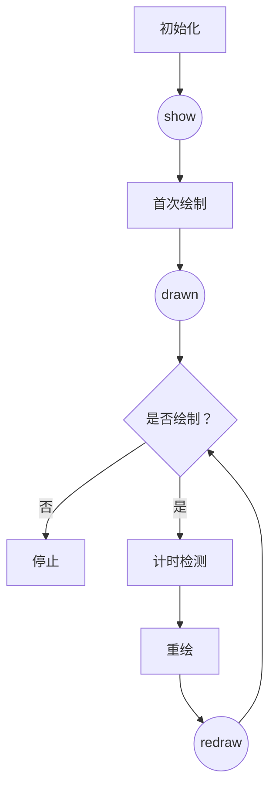

# PsychoPy-Scene


[English](README.md) | 简体中文

将 [PsychoPy](https://github.com/psychopy/psychopy) 实验构建为可复用的画面（Scene）

行为实验是一系列画面 scene 的组合，编写实验程序只需 2 步：创建 scene 和呈现 scene

使用 PsychoPy:

```py
while running:
    stimulus.draw()
    win.flip()

    keys = keyboard.getKeys()
    if keys: ...
    if timeout: ...
```

使用 PsychoPy-Scene:

```py
@duration(3)
@close_on("key_space")
@hardware_keyboard()
@ctx.scene
def fixation(condition):
    return stimulus

result = fixation.show(condition)
```

## 安装

```bash
pip install psychopy-scene>=0.4,<0.5
```

## 快速上手

### Context

这是 scene 间的共享数据，比如绘制窗口 `Window`。
编写实验的第一步，就是创建实验上下文。

```python
from psychopy import visual, data
from psychopy_scene import Context

ctx = Context(win=visual.Window(), exp=data.ExperimentHandler())
```

### Scene

用 `ctx.scene` 创建画面，用装饰器改变 scene 的行为：

```python
from psychopy import visual
from psychopy.hardware import keyboard
from psychopy_scene.decorator import duration, hardware_keyboard

# create stimulus
stim_1 = visual.TextStim(ctx.win, text="Hello")
stim_2 = visual.TextStim(ctx.win, text="World")

# create scene
@duration(1)
@ctx.scene
def demo_1(color: str, ori: float):
    print('it will be called before first flip')
    stim_1.color = color
    stim_2.ori = ori
    return stim_1, stim_2

@close_on('key_space')
@hardware_keyboard()
@ctx.scene
class demo_2:
    scene: Scene
    def __call__(self, text: str):
        stim_1.text = text
        return stim_1
    def on_key_space(self, evt: keyboard.KeyPress):
        self.scene.data['rt'] = evt.tDown - self.scene.data['start_time']

# show scene
data_1 = demo_1.show(color="red", ori=45)
data_2 = demo_2.show(text="test")
```

> [!IMPORTANT]
> 装饰器会改变 scene 的状态，它们通过 scene 实例暴露的 api 实现这点

时间相关的装饰器会相互覆盖，因为它们通过设置 scene.timer 属性起作用。

这在一些场景中很有用，比如呈现时间不固定的画面：

```python
@duration(1)
@ctx.scene
def demo():
    return stim

data = demo.use(duration(0.5)).show()
```

有时需要向所有画面添加默认行为，这可以通过包装 `ctx.scene` 实现。比如按 Esc 终止实验：

```py
def wrapped_scene(comp):
    return (
        ctx.scene(comp)
        .use(hardware_keyboard())
        .on("key_escape", lambda _: core.quit())
    )

@wrapped_scene
def demo():
    return stim
```

### 实验记录

scene 会自动记录首次 flip 时间戳，可通过 `data['start_time']` 获取：

```python
@close_on('key_f', 'key_j')
@hardware_keyboard()
@ctx.scene
def demo():
    return stim

data = demo.show() # just a dict
onset = data['start_time']
```

用 `record_frames` 装饰器收集完整帧时间戳列表：

```python
from psychopy_scene.decorator import record_frames

data = demo.use(record_frames).show()
frame_times = data['frame_times']
```

也支持手动收集自定义数据：

```python
@hardware_keyboard()
@ctx.scene
class demo:
    scene: Scene
    def __call__(self):
        return stim
    def on_key_f(self, evt: keyboard.KeyPress):
        self.scene.data['pressed_duration'] = evt.duration

data = demo.show()
duration = data['pressed_duration']
```

### 事件

事件表示画面呈现时的某个特定时机，比如按下按键、点击鼠标等。
要想在事件发生时执行一些操作，需要为事件添加回调函数:

```py
scene.on('show', lambda _: print('do something'));
```

这是 scene 全部内置事件及其触发时机：


```mermaid
graph TD
初始化 --> s((show)) --> 首次绘制 --> d((drawn)) --> c{是否绘制？}
c -->|否| 停止
c -->|是| 计时检测 --> 重绘 --> r((redraw)) --> c
```

在 `drawn` 和 `redraw` 期间会把对应的帧时间戳作为事件值传出，
第一次的帧时间也会存放在 `data['start_time']` 中。

输入设备相关的装饰器能提供额外的事件支持，比如 `hardware_keyboard` 提供了 `key_space` 事件，让那些使用 `scene.on('key_space', ...)` 添加的回调函数能在按下 `space` 键时被触发执行。

这些装饰器会在 `redraw` 事件触发时通过 `scene.emit('key_space', ...)` 触发其他事件，实现对某些事件的支持。

## 示例

PsychoPy-Scene 把实验拆分成了一系列可配置画面，基于此可以方便地对 trial / block 进行封装，只暴露出 trial / block 相关的参数配置。

### Trial

```python
from psychopy import visual
from psychopy_scene import Context
from psychopy_scene.decorator import duration

def trial(ctx: Context, sec = 1):
    stim = visual.TextStim(ctx.win, text="")
    scene = ctx.scene(lambda: stim).use(duration(sec))
    data = scene.show()
    ctx.record(time=data['start_time'])
```

### Block

```python
from psychopy import visual
from psychopy_scene import Context
from psychopy_scene.decorator import duration

def trial(ctx: Context):
    stim = visual.TextStim(ctx.win, text="")
    scene = ctx.scene(lambda: stim).use(duration(1))
    data = scene.show()
    ctx.record(time=data['start_time'])

win = visual.Window()
data = []
for block_index in range(10):
    ctx = Context(win)
    ctx.exp.extraInfo['block_index'] = block_index
    trial(ctx)
    block_data = ctx.exp.getAllEntries()
    data.extend(block_data)
```
