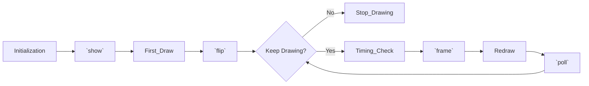

# PsychoPy-Scene


English | [简体中文](README_zh.md)

A lightweight experimental framework based on [PsychoPy](https://github.com/psychopy/psychopy), with core source code **< 150 lines**.

> [!NOTE]
> This project is in its early stages of development. Please pin the version number when using it.

## Features

- **Lightweight**: Only 2 files, no additional dependencies.
- **Type-safe**: Uses generics for type inference.
- **Beginner-friendly**: Only requires mastering the concepts of `Context` and `Scene` to get started.

## Installation

```bash
pip install psychopy-scene
```

## Quick Start

### Experimental Context

The `Context` represents the global parameters of the experiment, including environmental and task parameters.
The first step in writing an experiment is to create the experimental context.

```python
from psychopy import visual, data
from psychopy_scene import Context

ctx = Context(win=visual.Window(), exp=data.ExperimentHandler())
```

### Scene

An experiment can be thought of as a combination of a series of `scenes`. Writing an experimental program requires only 2 steps:

1. Create the scene.
2. Write the scene presentation logic.

Create scenes using decorators:

```python
from psychopy import visual
from psychopy.hardware import keyboard
from psychopy_scene.decorator import duration, hardware_keyboard

# create stimulus
stim_1 = visual.TextStim(ctx.win, text="Hello")
stim_2 = visual.TextStim(ctx.win, text="World")

# create scene
@duration(1)
@ctx.scene
def demo_1(color: str, ori: float):
    print('it will be called before first flip')
    stim_1.color = color
    stim_2.ori = ori
    return stim_1, stim_2

@close_on('key_space')
@hardware_keyboard()
@ctx.scene
class demo_2:
    scene: Scene
    def __call__(self, text: str):
        stim_1.text = text
        return stim_1
    def on_key_space(self, evt: keyboard.KeyPress):
        self.scene.data['rt'] = evt.tDown - self.scene.data['frame_times'][0]

# show scene
data_1 = demo_1.show(color="red", ori=45)
data_2 = demo_2.show(text="test")
```

Some decorators can be overridden, which is useful in scenarios like scenes with variable durations:

```python
@duration(1)
@ctx.scene
def demo():
    return stim

data = demo.use(duration(0.5)).show()
```

### Data

Data is automatically collected during the scene presentation:
| Name | Description |
| --------- | ---------------------------- |
| frame_times | Timestamps for each frame flip |

We can access this data via `scene.data`:

```python
@close_on('key_f', 'key_j')
@hardware_keyboard()
@ctx.scene
def demo():
    return stim

data = demo.show()
show_time = data["frame_times"][0]
```

We can also collect data manually:

```python
@hardware_keyboard()
@ctx.scene
class demo:
    scene: Scene
    def __call__(self):
        return stim
    def on_key_f(self, evt: keyboard.KeyPress):
        self.scene.data['pressed_duration'] = evt.duration

data = demo.show()
duration = data['pressed_duration']
```

### Events

Events represent specific timings during program execution, such as key presses or mouse clicks.
To perform operations when an event occurs, we need to add callback functions to the events.

Available event types are provided by decorators: `hardware_keyboard`, `event_mouse`.
These events will be triggered during the `poll` phase of the scene lifecycle:



## Examples

### Trial

```python
from psychopy import visual
from psychopy_scene import Context
from psychopy_scene.decorator import duration

def task(ctx: Context, sec = 1):
    stim = visual.TextStim(ctx.win, text="")
    scene = ctx.scene(lambda: stim).use(duration(sec))
    data = scene.show()
    ctx.record(time=data['frame_times'][0])
```

### Block

```python
from psychopy import visual
from psychopy_scene import Context
from psychopy_scene.decorator import duration

def task(ctx: Context):
    stim = visual.TextStim(ctx.win, text="")
    scene = ctx.scene(lambda: stim).use(duration(1))
    data = scene.show()
    ctx.record(time=data['frame_times'][0])

win = visual.Window()
data = []
for block_index in range(10):
    ctx = Context(win)
    ctx.exp.extraInfo['block_index'] = block_index
    task(ctx)
    block_data = ctx.exp.getAllEntries()
    data.extend(block_data)
```
