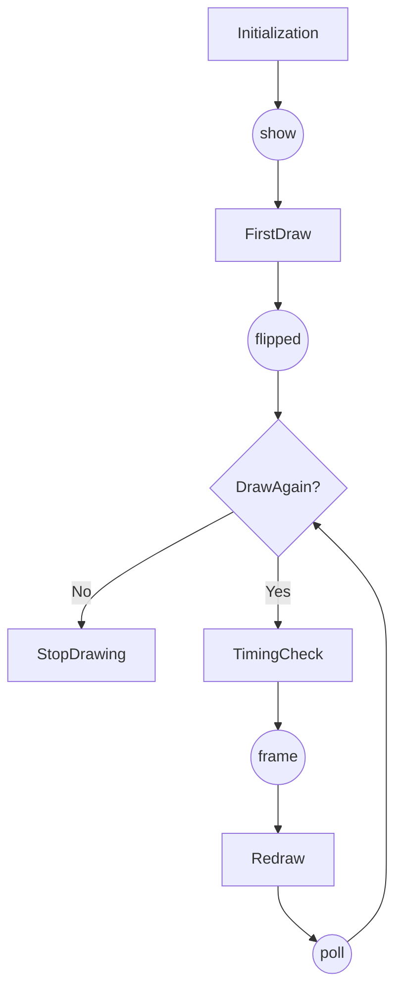

# PsychoPy-Scene


English | [简体中文](README.zh-CN.md)

A lightweight framework based on the Scene architecture, for [PsychoPy](https://github.com/psychopy/psychopy).

> [!NOTE]
> This project is still in early development. Please pin the version when using it.

## Features

- **Lightweight:** Only 2 files, with no additional dependencies
- **Type-safe:** Supports generics
- **Beginner-friendly:** You only need to understand the concepts of `Context` and `Scene` to get started

## Installation

```bash
pip install psychopy-scene
```

## Quick Start

### Context

`Context` encapsulates data shared across scenes, such as the drawing window `Window`.

The first step is to create an experiment context.

```python
from psychopy import visual, data
from psychopy_scene import Context

ctx = Context(win=visual.Window(), exp=data.ExperimentHandler())
```

### Scenes

An experiment can be viewed as a composition of a series of scenes. To write an experiment, you only need to:

1. Create a scene
2. Define its presentation logic

Create a scene using a decorator:

```python
from psychopy import visual
from psychopy.hardware import keyboard
from psychopy_scene.decorator import duration, hardware_keyboard

# create stimulus
stim_1 = visual.TextStim(ctx.win, text="Hello")
stim_2 = visual.TextStim(ctx.win, text="World")

# create scene
@duration(1)
@ctx.scene
def demo_1(color: str, ori: float):
    print('it will be called before first flip')
    stim_1.color = color
    stim_2.ori = ori
    return stim_1, stim_2

@close_on('key_space')
@hardware_keyboard()
@ctx.scene
class demo_2:
    scene: Scene

    def __call__(self, text: str):
        stim_1.text = text
        return stim_1

    def on_key_space(self, evt: keyboard.KeyPress):
        self.scene.data['rt'] = evt.tDown - self.scene.data['frame_times'][0]

# show scene
data_1 = demo_1.show(color="red", ori=45)
data_2 = demo_2.show(text="test")
```

> [!IMPORTANT]
> Decorators modify the state of a scene through the API exposed by the scene instance.

Time-related decorators override one another because they work by setting the scene's `timer` attribute.

This can be useful in situations where the presentation duration is not fixed:

```python
@duration(1)
@ctx.scene
def demo():
    return stim

data = demo.use(duration(0.5)).show()
```

### Data

A scene automatically collects data:

| Name        | Description                  |
| ----------- | ---------------------------- |
| frame_times | Timestamp of each frame flip |

The data can be accessed through `scene.data`:

```python
@close_on('key_f', 'key_j')
@hardware_keyboard()
@ctx.scene
def demo():
    return stim

data = demo.show() # just a dict
show_time = data["frame_times"][0]
```

Manual data collection is also supported:

```python
@hardware_keyboard()
@ctx.scene
class demo:
    scene: Scene

    def __call__(self):
        return stim

    def on_key_f(self, evt: keyboard.KeyPress):
        self.scene.data['pressed_duration'] = evt.duration

data = demo.show()
duration = data['pressed_duration']
```

### Events

An event represents a specific time point during scene showing, such as a key press or mouse click.

To execute an action when an event occurs, add a callback for that event:

```python
scene.on('show', lambda _: print('do something'));
```

These are all the built-in scene events and when they are triggered:


```mermaid
graph TD
Initialization --> s((show)) --> FirstDraw --> f((flipped)) --> c{DrawAgain?}
c -->|No| StopDrawing
c -->|Yes| TimingCheck --> a((frame)) --> Redraw --> p((poll)) --> c
```

Some event types are provided by decorators associated with input devices. For example, `hardware_keyboard` provides support for the `key_space` event, allowing callbacks registered with `scene.on('key_space', ...)` to be triggered when the `space` key is pressed.

These decorators trigger other events during the `poll` event by calling `scene.emit('key_space', ...)`.

## Examples

### Trial

```python
from psychopy import visual
from psychopy_scene import Context
from psychopy_scene.decorator import duration

def task(ctx: Context, sec=1):
    stim = visual.TextStim(ctx.win, text="")
    scene = ctx.scene(lambda: stim).use(duration(sec))
    data = scene.show()
    ctx.record(time=data['frame_times'][0])
```

### Block

```python
from psychopy import visual
from psychopy_scene import Context
from psychopy_scene.decorator import duration

def task(ctx: Context):
    stim = visual.TextStim(ctx.win, text="")
    scene = ctx.scene(lambda: stim).use(duration(1))
    data = scene.show()
    ctx.record(time=data['frame_times'][0])

win = visual.Window()
data = []

for block_index in range(10):
    ctx = Context(win)
    ctx.exp.extraInfo['block_index'] = block_index
    task(ctx)
    block_data = ctx.exp.getAllEntries()
    data.extends(block_data)
```
