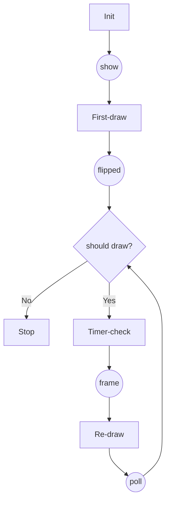

# PsychoPy-Scene


English | [简体中文](README-zh.md)

Build [PsychoPy](https://github.com/psychopy/psychopy) experiments as reusable **Scenes**.

A behavioral experiment is a composition of scenes. Writing an experiment program only takes two steps: **create scenes and show them**.

Before:

```py
while running:
    stimulus.draw()
    win.flip()

    keys = keyboard.getKeys()
    if keys: ...
    if timeout: ...
```

After:

```py
@duration(3)
@close_on("key_space")
@hardware_keyboard()
@ctx.scene
def fixation(condition):
    return stimulus

result = fixation.show(condition)
```

## Installation

```bash
pip install "psychopy-scene>=0.3,<0.4"
```

## Quick Start

### Context

A `Context` contains resources shared between scenes, such as the drawing `Window` and the `ExperimentHandler`.

Creating a context is the first step when writing an experiment:

```python
from psychopy import visual, data
from psychopy_scene import Context

ctx = Context(win=visual.Window(), exp=data.ExperimentHandler())
```

### Scene

Use `ctx.scene` to create a Scene, and use decorators to modify its behavior:

```python
from psychopy import visual
from psychopy.hardware import keyboard
from psychopy_scene import Scene
from psychopy_scene.decorator import close_on, duration, hardware_keyboard

# create stimuli
stim_1 = visual.TextStim(ctx.win, text="Hello")
stim_2 = visual.TextStim(ctx.win, text="World")

# create scenes
@duration(1)
@ctx.scene
def demo_1(color: str, ori: float):
    print("it will be called before the first flip")
    stim_1.color = color
    stim_2.ori = ori
    return stim_1, stim_2

@close_on("key_space")
@hardware_keyboard()
@ctx.scene
class demo_2:
    scene: Scene

    def __call__(self, text: str):
        stim_1.text = text
        return stim_1

    def on_key_space(self, evt: keyboard.KeyPress):
        self.scene.data["rt"] = (
            evt.tDown - self.scene.data["frame_times"][0]
        )

# show scenes
data_1 = demo_1.show(color="red", ori=45)
data_2 = demo_2.show(text="test")
```

> [!IMPORTANT]
> Decorators modify the state of a Scene through the API exposed by the Scene instance.

Timing-related decorators override one another because they work by setting the `scene.timer` attribute.

This can be useful when the presentation duration needs to vary:

```python
@duration(1)
@ctx.scene
def demo():
    return stim

data = demo.use(duration(0.5)).show()
```

Sometimes you may want to add default behavior to every Scene. This can be done by wrapping `ctx.scene`. For example, to terminate the experiment when `Esc` is pressed:

```py
def wrapped_scene(comp):
    return (
        ctx.scene(comp)
        .use(hardware_keyboard())
        .on("key_escape", lambda _: core.quit())
    )

@wrapped_scene
def demo():
    return stim
```

### Data

A Scene automatically records the timestamp of every frame flip. These timestamps are available through `scene.data["frame_times"]`:

```python
@close_on("key_f", "key_j")
@hardware_keyboard()
@ctx.scene
def demo():
    return stim

data = demo.show()  # just a dict
show_time = data["frame_times"][0]
```

You can also collect custom data manually:

```python
@hardware_keyboard()
@ctx.scene
class demo:
    scene: Scene

    def __call__(self):
        return stim

    def on_key_f(self, evt: keyboard.KeyPress):
        self.scene.data["pressed_duration"] = evt.duration

data = demo.show()
duration = data["pressed_duration"]
```

### Events

Events represent specific points in a Scene's presentation lifecycle, such as a key press or mouse click.

To perform an action when an event occurs, register a callback for that event:

```py
scene.on("show", lambda _: print("do something"))
```

These are the built-in Scene events and their timing:


```mermaid
graph TD
Init --> s((show)) --> First-draw --> f((flipped)) --> c{should draw?}
c -->|No| Stop
c -->|Yes| Timer-check --> a((frame)) --> Re-draw --> p((poll)) --> c
```

Input-related decorators can provide additional events. For example, `hardware_keyboard` provides the `key_space` event, allowing callbacks registered with `scene.on("key_space", ...)` to run when the `Space` key is pressed.

These decorators listen to the `poll` event and use `scene.emit("key_space", ...)` to emit additional events.

## Examples

PsychoPy-Scene lets you split an experiment into a series of configurable Scenes. This makes it straightforward to build higher-level abstractions such as **trials** and **blocks**, while exposing only the parameters relevant to each abstraction.

### Trial

```python
from psychopy import visual
from psychopy_scene import Context
from psychopy_scene.decorator import duration

def trial(ctx: Context, sec=1):
    stim = visual.TextStim(ctx.win, text="")
    scene = ctx.scene(lambda: stim).use(duration(sec))
    data = scene.show()
    ctx.record(time=data["frame_times"][0])
```

### Block

```python
from psychopy import visual
from psychopy_scene import Context
from psychopy_scene.decorator import duration

def trial(ctx: Context):
    stim = visual.TextStim(ctx.win, text="")
    scene = ctx.scene(lambda: stim).use(duration(1))
    data = scene.show()
    ctx.record(time=data["frame_times"][0])

win = visual.Window()
data = []

for block_index in range(10):
    ctx = Context(win)
    ctx.exp.extraInfo["block_index"] = block_index
    trial(ctx)
    block_data = ctx.exp.getAllEntries()
    data.extend(block_data)
```
